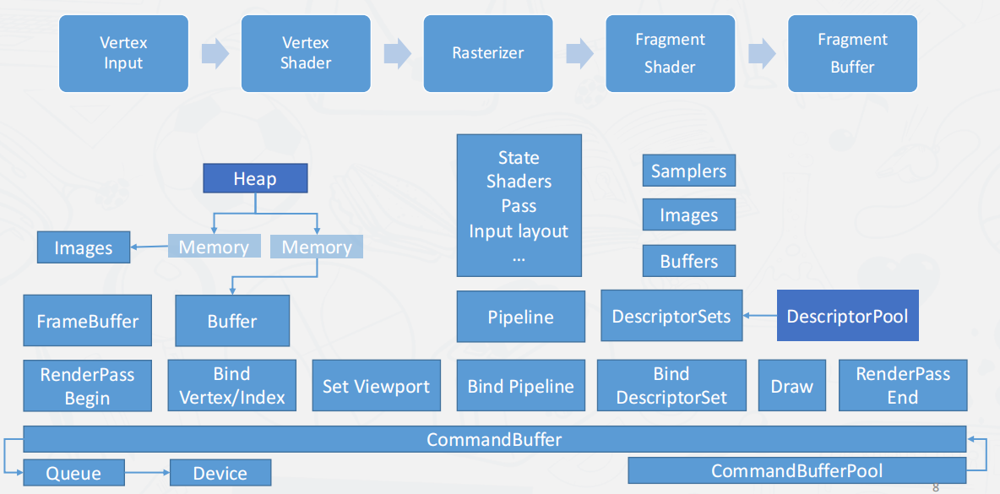

# games106-homework

the homework of game106

[作业提交地址](http://cn.ces-alpha.org/account/)
[作业项目地址](https://github.com/dodoleon/games106)
[课程主页](https://zju-rendering.github.io/games106/)

## homework

[homework0](homework0/hw0.md)
[homework1](homework1/hw1.md)

## reference

《Vulkan应用开发指南》
[Vulkan 教程|极客教程 (geek-docs.com)](https://geek-docs.com/vulkan/vulkan-tutorial/vulkan-tutorial-index.html)
<https://github.com/G-FI/games106/tree/master>
<https://github.com/kobato0328/games106/tree/master/homework>

## Vulkan

## 调试工具

[RenderDoc](https://renderdoc.org/)
[NVIDIA Nsight Graphics](https://developer.nvidia.com/nsight-graphics)
