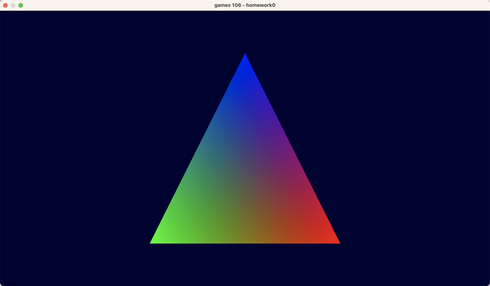
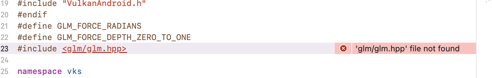
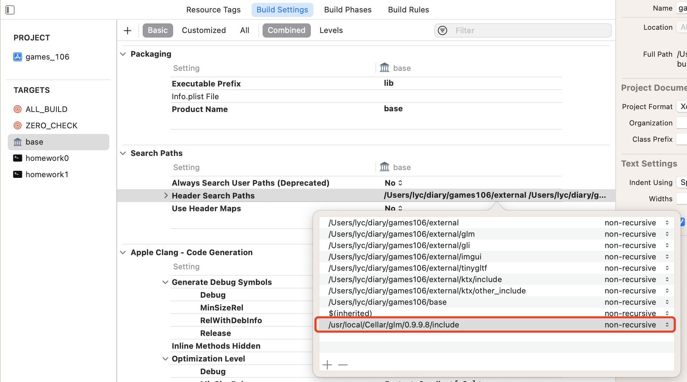

# games106 hw0

作业要求：环境配置，运行hw0


## 问题一：cmake找不到vulkan dylib

解决方法：下载安装 [vulkan SDK](https://vulkan.lunarg.com/sdk/home#mac)

## 问题二：glm.hpp not found



解决方法：
手动：
1.先下载glm库，可以使用 brew install glm
2.xcode 项目中 build-settings-Search Paths添加glm库的路径


自动：
下载submodule,会下载glm库文件到external文件夹:

```c++
git submodule init
git submodule update
```

## 问题三：找不到data中的assets

解决方法：把data文件夹复制到build中，或者cmake的时候不新建文件夹目录
