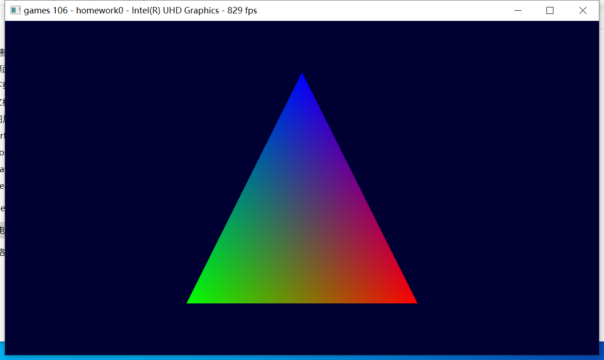

# games106 hw0

环境配置

## MAC

问题一：cmake找不到vulkan dylib
解决方法：下载安装 [vulkan SDK](https://vulkan.lunarg.com/sdk/home#mac)

问题二：编译homework0报错

解决方法：
1.先下载glm库，可以使用 brew install glm
2.xcode 项目中 build-settings-Search Paths添加glm库的路径

问题三：找不到data中的assets
解决方法：把data文件夹复制到build中

大功告成！

## windows

cmake

编译报错缺少gml.hpp

下载glm库文件放入base文件夹重新编译即可
git submodule update --init --recursive
可以下载glm依赖库

