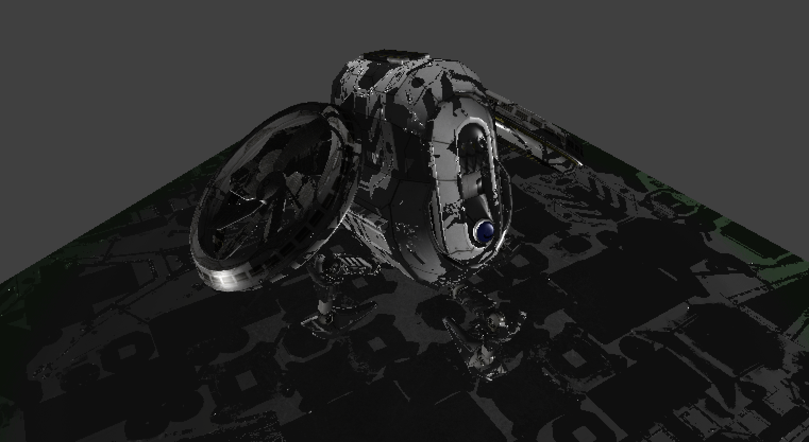

# hw1

作业过程中遇到对vulkan和框架不熟悉的地方，最好的方式就是看vulkan官方tutorial文档和examples示例代码！

[vulkan_pipeline](../vulkan_pipeline/vulkan_pipeline.md)

## 1.支持gltf的骨骼动画


示例examples/gltfskinning/gltfskinning.cpp中的实现是有皮肤数据的，homework1中的gltf数据读出来是没有skin数据的。毕竟hw1中的模型是个机器飞机，没有皮肤才正常。

所以我们要做的就是修改Node结构体，增加Animation相关结构体，读取、存储、更新Animation，同时更新shader中的PushConsts model矩阵，vertex shader中通过mvp变换，即通过改变了顶点位置实现了骨骼动画，不用重新编译shader。

**关键点**：
在void updateAnimation(float deltaTime)中根据动画数据更新了每个相关Node的transform。注意示例中是通过updateJoints函数中来更新shader中的joint matrices，以实现骨骼动画。我们不需要updateJoints函数，通过在updateAnimation后修改model并pushConst给shader实现骨骼动画。
需要修改LoadNode函数，添加index的设置。

**方法一**：

1. 直接在drawNode中通过vkCmdPushConstants给GPU传递当前node的model值
2. 不需要修改默认的shader和descriptorset
3. 需要每一帧都调用buildCommandBuffers

```c++
// drawNode函数中，由于此代码在buildCommandBuffers()中调用，但是buildCommandBuffers并不会没帧调用，需要自行修改
glm::mat4 nodeMatrix = node->getLocalMatrix();
VulkanglTFModel::Node* currentParent = node->parent;
while (currentParent) {
    nodeMatrix = currentParent->getLocalMatrix() * nodeMatrix;
    currentParent = currentParent->parent;
}
// Pass the final matrix to the vertex shader using push constants
vkCmdPushConstants(commandBuffer, pipelineLayout, VK_SHADER_STAGE_VERTEX_BIT, 0, sizeof(glm::mat4), &nodeMatrix);
```

[方法一代码](hw1history/homework1_1.cpp)

**方法二**：

1. 顶点结构体添加NodeIndex，表示每个顶点属于哪个node
2. 使用着色器块存储缓冲区buffer存储和传递动画更新时每个node的变化矩阵
3. 在vertex shader中根据NodeIndex选择合适的model变化矩阵，变化顶点位置

## 2.支持gltf的PBR的材质(包括法线贴图)

1. 先学习了解gltf材质相关概念
   
2. gltf的的每个材质，都有r、g、b和一组对应的纹理，扩充material结构体，保存材质属性和各个纹理的索引，并添加descriptorSet
3. 更新setupDescriptors()函数中的相关设置,images换成materials,添加额外的绑定
4. drawNode时，根据node-mesh-primitives下使用的材质索引，绑定对应材质的descriptorSet
5. 在pixel shader中使用材质属性和纹理更新颜色

bugfix：

**BUG01**：

normalMap导入计算新的法线后，出现奇怪的黑影
问题产生的原因是normalMapTextureIndex没有读取成功，默认把index为0的texture作为的normalmap，在LoadMaterials中做修改即可解决：
```c++
// Get normal texture index
if (glTFMaterial.values.find("normalTexture") != glTFMaterial.values.end()) {
    materials[i].normalTextureIndex = glTFMaterial.values["normalTexture"].TextureIndex();
}

// values改为additionalValues
if (glTFMaterial.additionalValues.find("normalTexture") != glTFMaterial.additionalValues.end()) {
    materials[i].normalTextureIndex = glTFMaterial.additionalValues["normalTexture"].TextureIndex();
}
```

**BUG02**：
vkAllocateDescriptorSets引发异常。检查VkDescriptorPoolSize创建的时候是否给了足够的size，如果size不够就会出现此bug。

## 3.Tone Mapping后处理(提高)

1. multi pass 可以参考examples中的bloom项目，建立后处理pass
2. 增加一个tone mapping的pass，对mesh pass输出的图像进行处理
3. tonemapping pass的输入应该是mesh pass的frag shader的输出。参考bloom项目。
[final代码](hw1history/homework1_3.cpp)
