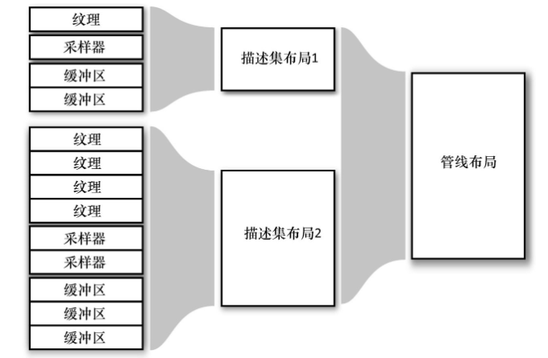

# homework1

作业1，扩展GLTF loading。作业1提供了一个gltf显示的demo，只支持静态模型，以及颜色贴图。作业1需要在这个基础上进行升级。
#### 作业提交

按照代码框架的目录（方便助教检查和运行代码），把修改的文件打包成zip，或者用git patch的方式提交作业代码。

#### 作业要求
1. 作业要求的gltf文件已经上传到了data/buster_drone/busterDrone.gltf
2. 支持gltf的骨骼动画。
3. 支持gltf的PBR的材质，包括法线贴图。
4. 必须在homework1的基础上做修改，提交其他框架的代码算作不合格。
5. 进阶作业：增加一个Tone Mapping的后处理pass。增加GLTF的滤镜功能。tonemap选择ACES实现如下。这个实现必须通过额外增加一个renderpass的方式实现。
```c++
// tonemap 所使用的函数
float3 Tonemap_ACES(const float3 c) {
    // Narkowicz 2015, "ACES Filmic Tone Mapping Curve"
    // const float a = 2.51;
    // const float b = 0.03;
    // const float c = 2.43;
    // const float d = 0.59;
    // const float e = 0.14;
    // return saturate((x*(a*x+b))/(x*(c*x+d)+e));

    //ACES RRT/ODT curve fit courtesy of Stephen Hill
	float3 a = c * (c + 0.0245786) - 0.000090537;
	float3 b = c * (0.983729 * c + 0.4329510) + 0.238081;
	return a / b;
}
```

直接运行会不成功缺少GLTF模型。以及字体文件。根据[文档](./data/README.md)下载 [https://vulkan.gpuinfo.org/downloads/vulkan_asset_pack_gltf.zip](https://vulkan.gpuinfo.org/downloads/vulkan_asset_pack_gltf.zip) 并且解压到./data文件夹中

下面是相关的资料

- GLTF格式文档 https://github.com/KhronosGroup/glTF
- 带动画的GLTF模型已经上传到了目录data/buster_drone/busterDrone.gltf。这个gltf文件来自于 https://github.com/GPUOpen-LibrariesAndSDKs/Cauldron-Media/tree/v1.0.4/buster_drone
  - Buster Drone by LaVADraGoN, published under a Attribution-NonCommercial 4.0 International (CC BY-NC 4.0) license
  - 作者存放在sketchfab上展示的页面 https://sketchfab.com/3d-models/buster-drone-294e79652f494130ad2ab00a13fdbafd
- 完成这个作业需要额外学习的内容，都可以在作业框架下找到示例代码用于学习和参照（example code 是学习一个api最好的老师🙂）
  - 骨骼动画在这个工程下有可以学习的样例 examples/gltfskinning/gltfskinning.cpp
  - PBR材质 
    - 直接光照 examples/pbrbasic/pbrbasic.cpp 
    - 环境光照 examples/pbribl/pbribl.cpp

## 开做

need redo，将一些不太清晰的概念记录在下面。

参考资料：
《Vulkan应用开发指南》

## 描述符集

描述符集是作为整体绑定到管线的资源的集合。可以同时将多个集合绑定到一个管线。每一个集合都有一个布局，布局描述了集合中资源的排列顺序和类型。两个拥有相同布局的集合被视为兼容的和可相互交换的。描述符集的布局通过一个对象表示，集合都是参照这个对象创建的。另外，可被管线访问的集合的集合组成了另一个对象—— 管线布局。管线通过参照这个管线布局对象来创建。



在任何时刻，应用程序都可以将一个新的描述符集绑定到命令缓冲区，只要具有相同的布局就行。相同的描述符集布局可以用来创建多个管线。

可调用vkCreateDescriptorSetLayout()来创建描述符集布局对象，其原型如下：

```c++
VkResult vkCreateDescriptorSetLayout (
    VkDevice                                           device,
    constVkDescriptorSetLayoutCreateInfo＊      pCreateInfo,
    constVkAllocationCallbacks＊                  pAllocator,
    VkDescriptorSetLayout＊                          pSetLayout);
```

```c++
typedef structVkDescriptorSetLayoutCreateInfo {
    VkStructureType                     sType; // 设为 VK_STRUCTURE_TYPE_DESCRIPTOR_SET_LAYOUT_CREATE_INFO
    const void＊                        pNext; // 设为 nullptr
    VkDescriptorSetLayoutCreateFlags    flags; // 留待以后使用，设为0
    uint32_t                            bindingCount; // 该集合中的绑定点个数
    constVkDescriptorSetLayoutBinding＊ pBindings; // 描述信息的数组的指针
} VkDescriptorSetLayoutCreateInfo;
```

```c++
typedef structVkDescriptorSetLayoutBinding {
    uint32_t                 binding; // 绑定序号
    VkDescriptorType       descriptorType; // 资源类型
    uint32_t                 descriptorCount; // 
    VkShaderStageFlags     stageFlags;
    constVkSampler＊       pImmutableSamplers;
} VkDescriptorSetLayoutBinding;
```